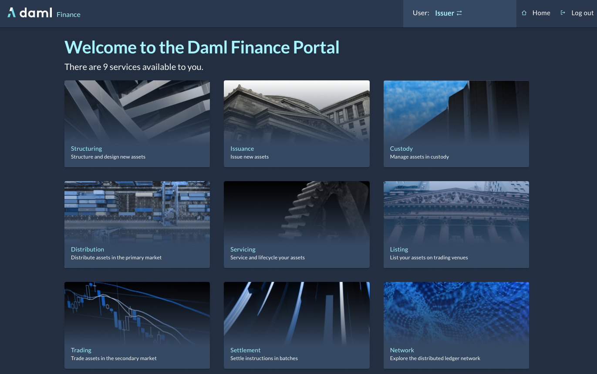

[](https://github.com/digital-asset/daml/blob/main/LICENSE)
[](https://dl.circleci.com/status-badge/redirect/gh/digital-asset/daml-finance-app/tree/main)

Copyright © 2023 Digital Asset (Switzerland) GmbH and/or its affiliates. All Rights Reserved. SPDX-License-Identifier: Apache-2.0

# Daml Finance Reference App

This Daml Finance Reference App showcases how the [Daml Finance](https://www.digitalasset.com/daml-finance) library can be integrated into a fully-fledged Daml application.



## Documentation

The [Daml Finance documentation](https://docs.daml.com/daml-finance) provides a number of
options to get started using the library.

## Running

On Linux or MacOS, run the following commands:
```
./scripts/get-dependencies.sh
daml start
```
On Windows, run the following:
```
./scripts/get-dependencies.bat
daml start
```

Wait until the sandbox is up and running, indicated by the following output:
```
...
Press 'r' to re-build and upload the package to the sandbox.
Press 'Ctrl-C' to quit.
```

Then, in another console run:
```
cd ui
npm install
npm start
```

## Contributing

### Dependencies

This repo assumes the use of [direnv] for local development, along with a
working [Nix] installation.

[direnv]: https://github.com/direnv/direnv
[Nix]: https://nixos.org/download.html
